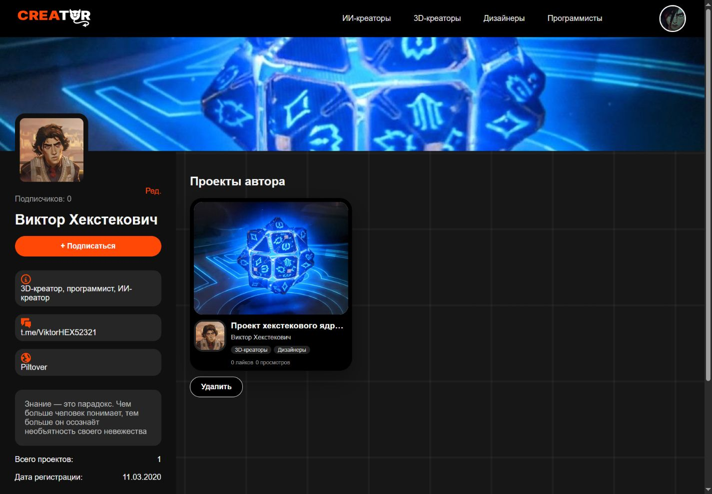
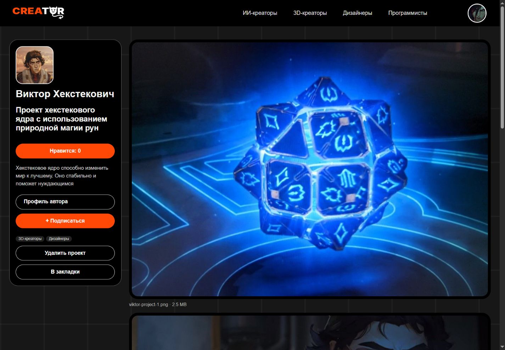
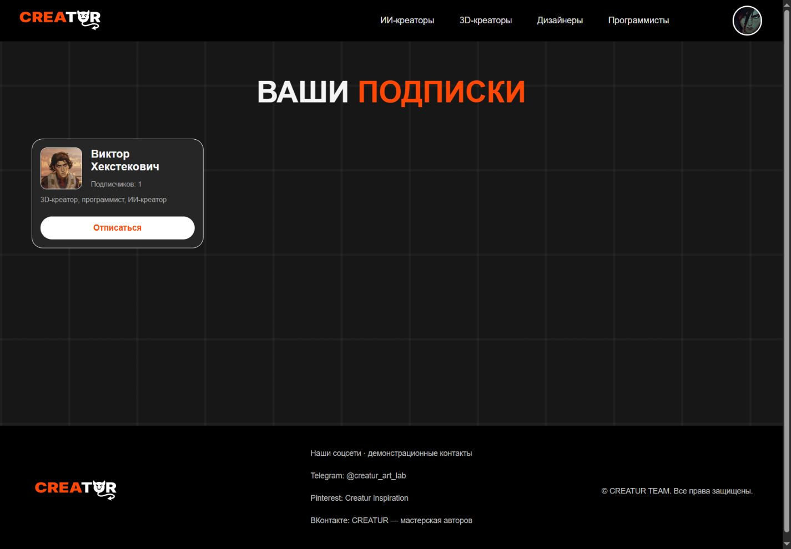

# Доработка CREATUR — 8 сентября 2026

Этот документ объясняет, что изменено перед итоговой сдачей учебного проекта,
почему выбраны эти решения и как проверить результат. Основная инструкция
запуска находится в [README](../README.md).

## Границы работы

CREATUR — некоммерческое портфолио авторов для бакалаврского проекта.
Здесь важны воспроизводимый запуск, настоящая база данных, понятные права
доступа и законченные пользовательские сценарии. Платежи, промышленное
масштабирование, сложная редакционная система и файловый конвертер не добавлялись.

Основа интерфейса — [предоставленный макет Figma](https://www.figma.com/design/XGYHDH6lleb0UyfCyi1nBI/Untitled--Copy-?node-id=0-1).
Сохранён существующий стек HTML/CSS/JavaScript: ради доработки не потребовалось
переписывать приложение на другой framework. Использованы оригинальные
экспортированные аватары, иллюстрации, favicon и иконки; они лежат в
`frontend/assets/figma` и не зависят от срока действия ссылок Figma.

## Резервная копия до изменений

На компьютере создана отдельная папка `C:\repositories\gleb_request-backup-20260908`:

- `project` — полный исходный проект из `C:\repositories\gleb_request`, включая
  историю Git, настройки, зависимости, загруженные файлы и старую SQLite-базу;
- `legacy-frontend` — отдельная копия раннего frontend из
  `C:\Users\kroko\Documents\gleb_request`;
- `creatur.dump` — архив PostgreSQL в custom-формате `pg_dump`.

Копия основного проекта проверена по числу файлов и суммарному размеру:
2624 файла, 374 473 666 байт. Содержимое архива БД проверено через
`pg_restore --list`. Рабочий каталог сохранён на прежнем месте; резервная
копия не используется для запуска и не включается в Git.

Внимание: резервная папка содержит локальные настройки и реальные данные.
Не публикуйте её целиком и не отправляйте в открытый репозиторий.

## PostgreSQL и перенос старых данных

Основной экземпляр — PostgreSQL 17, база `creatur`. До переноса в нём были
12 пользователей, 12 проектов, 12 записей файлов и 34 категории. В старой
SQLite нашлись записи, отсутствовавшие в PostgreSQL.

Добавлен `backend/prisma/import-sqlite.mjs`. Он читает SQLite без изменения
источника, проверяет наличие файлов и выполняет перенос в транзакции.
Без `--apply` изменения откатываются: это предварительная проверка.

При переносе добавлены 4 пользователя, 3 проекта, 1 запись файла,
7 связей проектов с категориями и 1 токен сброса пароля. Общие аккаунты
сопоставлены по email, категории — по группе и slug. Существующие данные
PostgreSQL не перезаписывались. Повторная пробная операция не создала дубликатов.
Отличающиеся версии уже существовавших записей остаются доступны в резервной
копии и исходной SQLite: импорт намеренно не выбирает за пользователя,
какая из двух версий текста или пароля должна заменить текущую.

После добавления четырёх авторов и работ из Figma база содержит
20 пользователей, 19 проектов, 19 записей файлов и 34 категории.
Это снимок состояния после доработки, а не постоянные значения счётчиков.
Оставлен один администратор `admin@creatur.local`; устаревший тестовый
`Dev User` переведён в обычную роль. Регистрация всегда создаёт `USER`.

### Что хранится где и почему

| Данные | Место | Причина |
| --- | --- | --- |
| Пользователи, проекты, категории, роли | PostgreSQL | Одна согласованная модель и связи с внешними ключами |
| Подписки, лайки, закладки, комментарии | PostgreSQL | Изменения сохраняются после перезагрузки и входа с другого устройства |
| Метаданные файлов и принадлежность проекту | PostgreSQL | Проверка доступа связана со статусом проекта и владельцем |
| Байты пользовательских работ | `backend/uploads` | Крупные файлы не раздувают таблицы; выдача только через защищённый API |
| Загруженные аватары и обложки | PostgreSQL, data URL | Простая переносимая реализация для небольшого проекта; до 2 МБ на изображение |
| Иллюстрации демонстрационных работ | `frontend/assets/figma` | Публичные ресурсы учебного макета доступны после клонирования |
| Локальные письма | `backend/.local-mail` | Проверка регистрации/сброса без почтового провайдера |

Файлы не становятся публичными просто из-за загрузки. Preview пользовательского
файла проверяет доступ на сервере. Прямой каталог `uploads` не публикуется.
Публичные картинки демонстрационных работ — отдельные заранее опубликованные
ресурсы макета, а не механизм выдачи пользовательских загрузок.

## Реализованные сценарии

### Профили и каталог

- Публичный профиль показывает опубликованные работы, описание, специализацию,
  контакт, город, аватар, обложку, дату регистрации и число подписчиков.
- Владелец меняет собственный профиль. Администратор может редактировать любой.
  Через этот API нельзя изменить email, пароль или роль.
- Личный кабинет показывает собственные неархивные работы и их статусы.
- Логотип возвращает к общему каталогу и сбрасывает поиск/фильтры.
  Разделы навигации выбирают соответствующую категорию, группы фильтров сворачиваются.
- Поиск учитывает регистр кириллицы. Для небольшого учебного каталога текстовое
  сравнение выполняется в приложении после выборки опубликованных записей.
  Для большого каталога потребуется поиск и пагинация непосредственно в БД.
- Ошибка API видна пользователю: локальный массив не подменяет реальные проекты.
  При возвращении в каталог список сверяется с сервером; черновики исключены
  и на клиенте, и в публичном API.

### Проекты и действия

- Подписка и отписка, отдельный экран подписок и пункт меню аккаунта.
- Лайк с отменой, закладки и список сохранённых опубликованных работ.
- Комментарии: добавление после входа; удаление собственного комментария или
  любого комментария администратором.
- Просмотр страницы увеличивает счётчик открытий. Это не аналитика уникальных
  посетителей; исторические демонстрационные счётчики старых работ сохранены.
- Удаление владельцем или администратором переводит проект в `ARCHIVED`.
  Проект и его preview перестают открываться, но записи и исходные файлы
  сохраняются. Автоматической очистки и кнопки восстановления сейчас нет.
- Нельзя отправить пустой проект без файлов на модерацию. Пока он `PENDING`,
  автор не меняет материалы. После отказа доступны правка и повторная отправка.

Тестовая подписка на последнем снимке после проверки удалена. Интерфейс
показывает настоящие связи, а не заранее нарисованные числа.

### Почта и контакты

По решению заказчика почта остаётся в локальном режиме. Регистрация создаёт
приветственное письмо, запрос восстановления — письмо со ссылкой на форму
сброса. Их JSON сохраняется в `backend/.local-mail`. На внешний почтовый ящик
эти письма не отправляются. Файлы могут содержать секретную ссылку сброса:
папка исключена из Git и не выдаётся через frontend.

Токен восстановления одноразовый: проверка/потребление токена и изменение
пароля выполняются согласованно в транзакции. Позже можно включить SMTP
через локальный `.env`, не передавая пароль в исходники.

Контакты в footer намеренно вымышленные: Telegram `@creatur_art_lab`, Pinterest
`Creatur Inspiration`, ВКонтакте `CREATUR — мастерская авторов`. Они помечены
как демонстрационные и не являются активными ссылками на возможные чужие аккаунты.

## Проверки

`npm test` в `backend` собирает TypeScript и запускает интеграционный сценарий
через настоящий HTTP-сервер и выбранную БД. Тест создаёт свои уникальные
аккаунты и файл, а в завершение удаляет только собственные тестовые данные.

Проверено автоматически:

- регистрация, дубликат email, неправильный пароль и ограничения роли;
- сохранение профиля, отсутствие секретных полей в публичном ответе;
- повторная подписка без дубликатов;
- создание, загрузка, отказ, повторная отправка и публикация;
- недоступность чужого черновика и его файлов, запрет лайка черновика;
- опубликованный preview, лайки, закладки и комментарии;
- запрет чужого удаления, архивирование администратором и закрытие preview;
- локальное письмо восстановления, смена пароля, отказ при повторном токене.

Один и тот же сценарий успешно выполнен на PostgreSQL и отдельной временной
SQLite-базе. Рабочая конфигурация после проверки возвращена на PostgreSQL.
Старая SQLite-база для этого теста не использовалась и не очищалась.

В браузере проверены вход, личный кабинет, редактор профиля, публичный профиль,
подписка с перезагрузкой, меню подписок и страница проекта с тремя изображениями.
Исправлены отображение карточек внутри профиля и обрезка длинных заголовков.
На проверенных страницах ошибок в журнале браузера не обнаружено.
Скриншоты выше сняты с работающего приложения, а не скопированы из Figma.

Проверка синтаксиса frontend, сборка backend и проверка пробелов Git проходят.
После обновления зависимостей `npm audit` не сообщает известных уязвимостей
на дату проверки. Это не заменяет полноценный аудит безопасности.

## Перенос на другой компьютер

> Обновление после уточнения заказчика: все текущие данные подтверждены как
> демонстрационные. Они уже включены в Git в виде `backend/demo/snapshot.json`
> и комплекта файлов. Для воспроизведения этой версии достаточно `git clone`,
> `npm run setup`, `npm start`; приватный дамп больше не требуется.
> Инструкция ниже остаётся применимой к отдельному переносу будущих изменений,
> которые ещё не экспортированы в демо-набор. Актуальный порядок — в README.

1. Клонируйте репозиторий, установите Node.js и PostgreSQL по README.
2. Создайте локальный `backend/.env` из примера. Секреты не хранятся в Git.
3. Установите зависимости и примените схему PostgreSQL.
4. Для демонстрации запустите seed: категории, базовые работы и четыре автора
   Figma воспроизводятся из репозитория. Повторный seed не заменяет существующие
   профили и пользовательские правки.
5. Для переноса **именно текущих данных**, а не демонстрации, дополнительно
   восстановите приватный `creatur.dump` в отдельную подготовленную базу и
   перенесите `backend/uploads`. Перед восстановлением в существующую БД
   сначала сделайте её копию; не очищайте рабочую БД вслепую.
6. Запустите оба приложения, выполните `npm test` и ручной сценарий из README.

Git хранит исходники, схемы, тесты, демонстрационные изображения и документацию.
Он намеренно **не хранит** пользовательские файлы, живую БД, `.env`, письма
и резервные архивы. Поэтому одного `git clone` достаточно для демонстрационной
версии, но не для переноса всех частных данных существующей установки.

## Известные ограничения

- Внешняя доставка почты пока не включена.
- 3D-просмотр ориентирован на GLB и самодостаточный glTF; конвертация произвольных
  3D-форматов и комплектов внешних текстур не реализована.
- Нет кнопки скачивания, но абсолютный запрет сохранения доступного браузеру
  содержимого технически не обеспечивается. Защита здесь — контроль доступа,
  а не DRM.
- Демонстрационные пароли публичны и предназначены только для локальной защиты
  учебной работы. Перед публичным размещением замените их и секрет сессии.
- Не добавлялись промышленная очередь обработки файлов, антивирусное сканирование,
  отказоустойчивость и нагрузочное тестирование. Это отдельный этап при реальном
  публичном запуске, а не скрытая часть текущей учебной сдачи.
